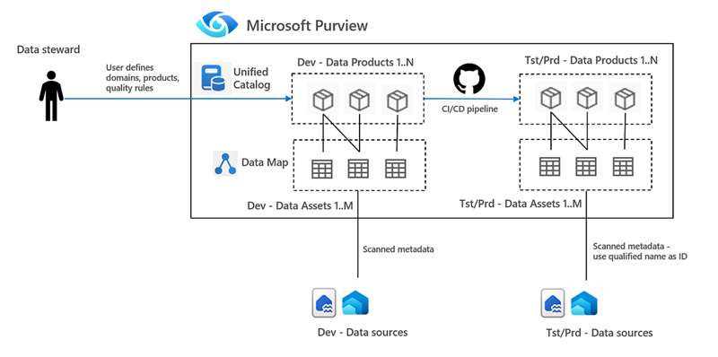

# CI/CD in Purview Unified Catalog
 Microsoft Purview is not built like a typical development environment. There's no "test" or "dev" instance you can spin up and throw away. Instead, everything lives in one tenant-level Purview account. That's fine for runtime metadata, but when you're working with design-time governance content, this can be challenging. In this repo we discuss a mechanism that can add desing time artificats of Purview Unified Catalog to git source control and can then deploy across Purview logical domains. See also image below.

1. Purview Unified Catalog - source control and deployment from DEV to Tst/Prd - image by author
 
The repo contains two sets of scripts that can help to build a CI/CD pipeline for Unified Catalog as follows:

- Scripts 01–04: These fetch governance metadata from the test domain and save it to disk. 
- Scripts 11–14: These read the saved files and deploy the metadata to the production domain.

In this scripts, the focus is on governance domains, data products, linking data products to data assets and data quality rules. Scripts can be expanded to other Unified Catalog artifacts such as glossary terms, OKRs, etc. 

Key principles behind the scripts are as follows:
- Logical names are used to identify governance artifacts like domains, data products, and data quality rules. This means no technical keys or hard coded IDs are required.
- If an artifact already exists in the target domain, it is updated instead of recreated. This avoids duplication and supports incremental changes.
- For linking data products to data assets, a runtime-generated key is needed. These keys are specific to the Data Map and can differ between environments.
- To avoid that linking data products needs technical that need to manually updated, the qualified name can be used, too. These qualified names are then used to look up the correct asset in the target environment before linking.

